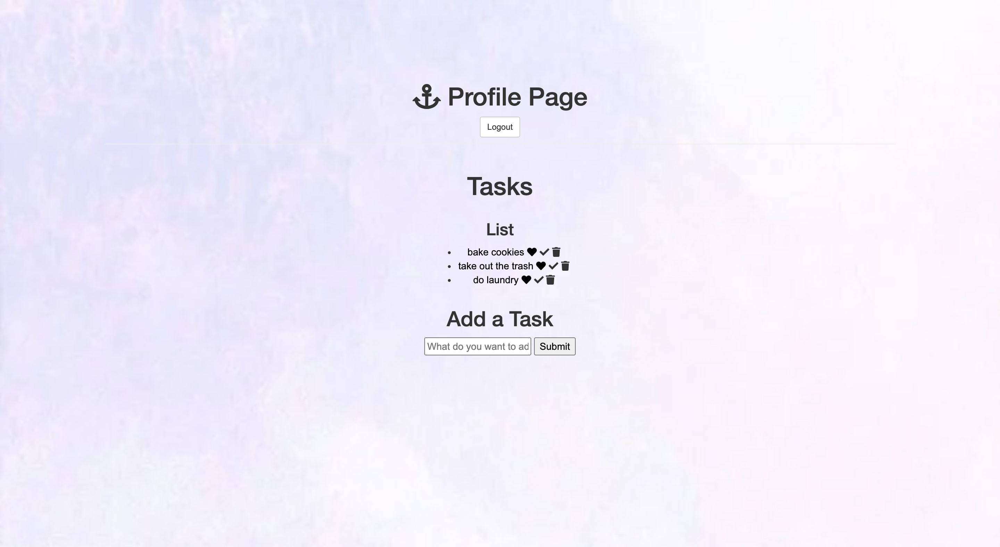

This is a full stack application with authentication where the users can enter important tasks and be able to check off whether it is completed or not.

How It's Made:

Tech Used: EJS, CSS, JavaScript, Node.js, Express.js and MongoDB.

Optimizations: 

Lesson Learned: I learned how to use CRUD functions and stored data in MongoDB. 

